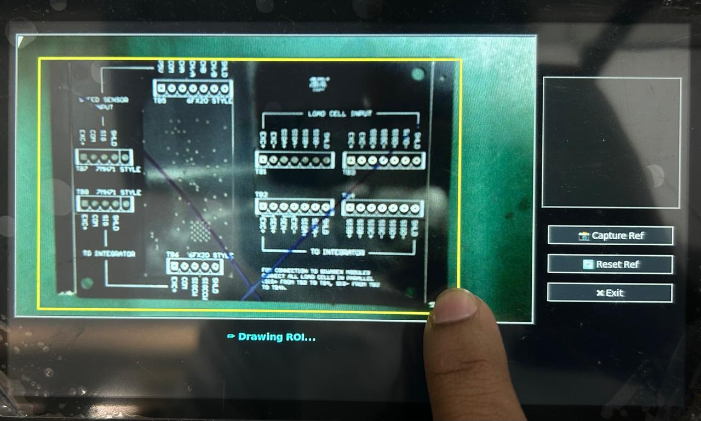
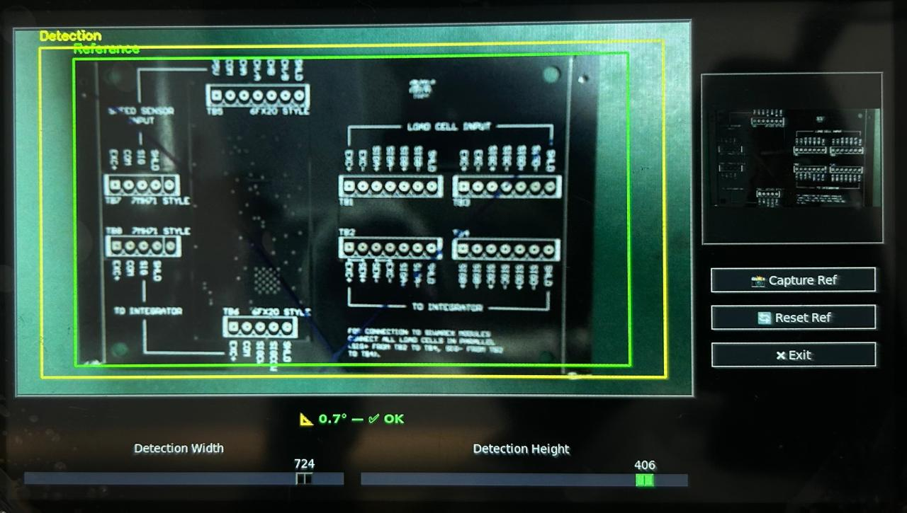
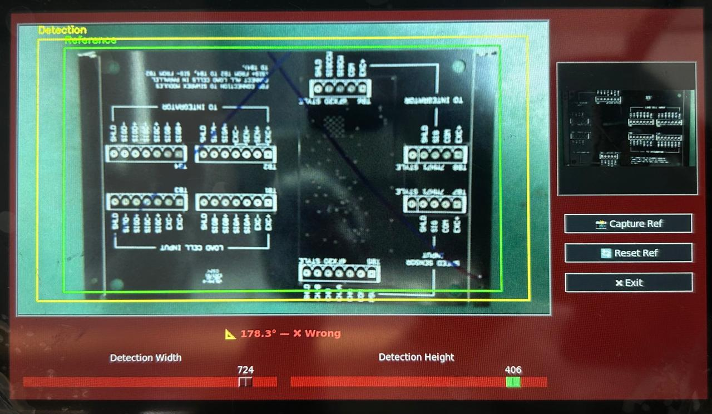

# Vision-Based PCB Alignment Detection System

A real-time PCB orientation detection system built using **Raspberry Pi 4B**, a **USB webcam**, **Python**, **OpenCV**, and a **Tkinter GUI**.

The system compares a live PCB image against a captured reference region using **ORB feature matching** and classifies the PCB as correctly or incorrectly aligned. Based on the result, it can trigger GPIO outputs for conveyor continuation or buzzer alerts.

---

## 🔎 Overview

Accurate PCB placement is important in wave soldering lines, where incorrect board orientation can cause soldering defects, rework, or production delays.

This project automates PCB orientation checking using computer vision. A reference PCB region is selected through the GUI, and incoming PCB frames are compared against it in real time.

The system includes:

- Live USB camera feed
- User-selectable ROI
- ORB feature matching
- Motion stability detection
- Rotation-angle estimation
- Tkinter-based GUI
- Raspberry Pi GPIO output support

---

## ✨ Features

- Real-time PCB orientation detection
- ORB keypoint detection and descriptor matching
- Homography-based rotation angle estimation
- Motion detection to avoid false checks while the PCB is moving
- Tkinter GUI for reference capture and ROI adjustment
- GPIO output for buzzer and conveyor/motor signal
- Cross-platform test version for Windows development

---

## 🖼️ Preview

### GUI Screenshot



### Sample Detection Images

| Reference PCB | Wrong Orientation |
|---|---|
|  |  |

---

## ⚙️ System Architecture

| Module | Description |
|---|---|
| Processing Unit | Raspberry Pi 4B |
| Camera | USB webcam |
| Software | Python, OpenCV, Tkinter |
| Vision Algorithm | ORB feature matching + homography |
| GUI | Tkinter full-screen interface |
| Output Control | Raspberry Pi GPIO |
| Alerts | Buzzer and conveyor/motor signal |

---

## 🛠️ Workflow

1. The USB camera captures the live PCB image.
2. The user draws a reference ROI using the GUI.
3. The selected ROI is captured as the reference PCB.
4. The system monitors the detection region.
5. Motion detection checks whether the PCB is stationary.
6. ORB keypoints and descriptors are extracted.
7. Feature matches are used to estimate the rotation angle.
8. If the PCB is aligned, the system shows **OK** and activates the conveyor/motor signal.
9. If the PCB is misaligned, the system shows **Wrong** and triggers the buzzer alert.

---

## 🧠 Detection Logic

The detection pipeline uses:

- ORB feature extraction
- Hamming-distance descriptor matching
- Homography estimation with RANSAC
- Rotation angle calculation from the homography matrix
- Frame differencing for motion stability
- ROI brightness and contour checking for PCB presence

Default parameters:

| Parameter | Value |
|---|---|
| Angle threshold | 10° |
| Motion threshold | 20 |
| Stability time | 0.3 s |
| ORB features | 1000 |
| Minimum matches | 10 |
| Frame size | 800 × 450 |
| Buzzer GPIO | BCM 18 |
| Motor/Conveyor GPIO | BCM 23 |

---

## 📁 Repository Structure

```text
pcb-alignment-detection-opencv/
├── src/
│   ├── pcb_orientation_detector_pi.py
│   └── pcb_orientation_detector_crossplatform.py
├── images/
│   └── gui_screenshot.png
├── samples/
│   ├── reference_pcb.jpg
│   └── wrong_orientation_pcb.jpg
├── requirements.txt
├── .gitignore
└── README.md
```

---

## 🚀 Running the Project

### Raspberry Pi Deployment Version

Use this version on Raspberry Pi with GPIO output:

```bash
python3 src/pcb_orientation_detector_pi.py
```

### Windows / PC Testing Version

Use this version to test the GUI and camera pipeline on Windows without Raspberry Pi GPIO hardware:

```bash
python src/pcb_orientation_detector_crossplatform.py
```

The cross-platform version uses mock GPIO when `RPi.GPIO` is unavailable.

---

## 📦 Requirements

Install dependencies:

```bash
pip install -r requirements.txt
```

Main dependencies:

- OpenCV
- NumPy
- Pillow
- RPi.GPIO for Raspberry Pi deployment

---

## 🔌 Hardware Connections

| Output | Raspberry Pi GPIO |
|---|---|
| Buzzer | GPIO 18 |
| Conveyor/Motor Signal | GPIO 23 |

> Use proper driver circuitry, relay isolation, or motor driver hardware when controlling external loads. Do not drive motors directly from Raspberry Pi GPIO pins.

---

## 📊 Results

The system was able to detect incorrect PCB orientation using feature-based image comparison. Motion stability checking helped reduce false detections while the PCB was moving into the camera region.

Observed strengths:

- Detects wrong PCB orientation
- Handles moderate rotation and scaling
- Avoids detection while the PCB is moving
- Provides GUI feedback and hardware output signals
- Can be tested on Windows using the cross-platform script

Current improvement areas:

- Robustness under varying lighting conditions
- Handling reflective PCB surfaces
- Improving confidence scoring for similar PCB layouts
- Future support for template matching or QR-based identification

---

## 🎯 Skills Demonstrated

- Python programming
- OpenCV computer vision
- Feature matching using ORB
- Tkinter GUI development
- Raspberry Pi GPIO integration
- Real-time image processing
- Industrial automation workflow
- Hardware-software integration

---

## ⚠️ Public Repository Note

Factory setup photos and production-specific images are not included to protect workplace and production confidentiality. Public sample images are used only to demonstrate the detection workflow.

---

## 👤 Author

**Rishoban Kandeepan**  
Embedded Systems | Sensor Integration | Real-Time Control

- GitHub: https://github.com/RishobanK
- Portfolio: https://www.notion.so/Hi-I-m-Rishoban-Kandeepan-251a48156db080fa80acd660c4368469
- LinkedIn: https://linkedin.com/in/rishoban-kandeepan
